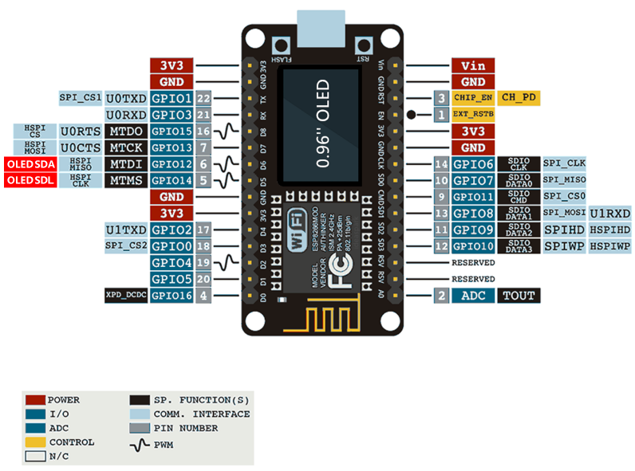

# Pinout

Placa ESP8266 + OLED 0.96" integrado (AI-Thinker ESP8266MOD). El OLED interno ya está cableado a **D6 (SDA)** y **D5 (SCL)**.

## Conexiones del proyecto

| Módulo | Señal | Pin placa | GPIO | Notas |
|--------|-------|-----------|------|-------|
| OLED (integrado) | SDA | D6 | 12 | Ya soldado en la placa |
| OLED (integrado) | SCL | D5 | 14 | Ya soldado en la placa |
| BMP180 | SDA | D2 | 4 | Bus I2C propio |
| BMP180 | SCL | D1 | 5 | Bus I2C propio |
| BMP180 | VCC / GND | 3V3 / GND | — | |
| DHT11 | DATA | D7 | 13 | |
| DHT11 | VCC / GND | 3V3 / GND | — | |
| MAX7219 | DIN | D8 | 15 | |
| MAX7219 | CLK | D4 | 2 | |
| MAX7219 | CS | D0 | 16 | |
| MAX7219 | VCC / GND | 5V / GND | — | Preferible 5V en VCC |

**No uses** los pines de la derecha (`CLK`, `SD0`, `CMD`, `SD1`…): son del flash interno.

Definiciones en `Config.h` (`BMP180_*`, `OLED_*`, `DHT11_PIN`, `MAX7219_*`).
