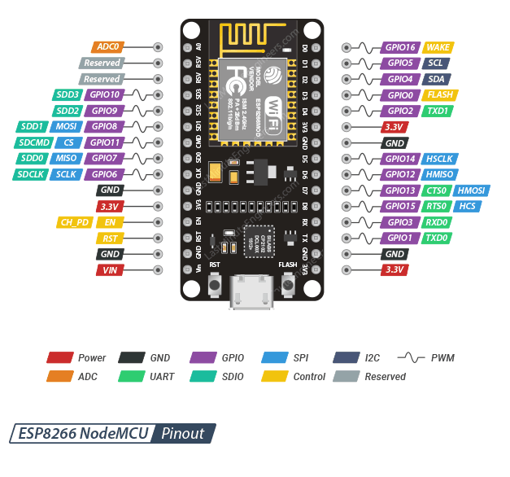

# Pinout

Placa **NodeMCU ESP8266** (Amica / v2, sin OLED integrado). Pinout de referencia:

## Conexiones del proyecto

| Módulo | Señal | Pin placa | GPIO | Notas |
|--------|-------|-----------|------|-------|
| BMP180 | SDA | D2 | 4 | Bus I2C |
| BMP180 | SCL | D1 | 5 | Bus I2C |
| BMP180 | VCC / GND | 3V3 / GND | — | |
| AHT10 | SDA | D2 | 4 | Mismo bus I2C que BMP180 |
| AHT10 | SCL | D1 | 5 | Mismo bus I2C que BMP180 |
| AHT10 | VCC / GND | 3V3 / GND | — | Dirección I2C `0x38` |

### Cableado AHT10 + BMP180 (resumen)

1. Uní **SDA** de ambos sensores a **D2** (GPIO4).
2. Uní **SCL** de ambos sensores a **D1** (GPIO5).
3. Alimentá ambos con **3V3** y **GND** comunes con la placa.
4. No hace falta niveladores: ambos sensores son 3.3 V.

### Pines libres (expansión exterior)

Disponibles para futuros sensores: **D0, D3, D4, D5, D6, D7, D8** y **A0** (ADC). Evitá usar RX/TX si necesitás el monitor serie.

**No uses** los pines de la izquierda del conector SDIO (`CLK`, `SD0`, `CMD`, `SD1`…): son del flash interno.

Definiciones en `Config.h` (`BMP180_*`, `AHT10_I2C_ADDR`).

Esta versión **no usa** OLED ni display MAX7219; la hora NTP se muestra solo en la web.
